# Behavioral Cloning
## Train a Deep Neural Network to Steer the Car

---

# Overview
The main goal of this project is to build and train a deep neural network to mimic human driving behavior. The trained model need to take image frames from camera which is positioned in the center of the car, and navigate the car through different tracks.  
In this project, I used a modified version of [Nvidia architecture](http://images.nvidia.com/content/tegra/automotive/images/2016/solutions/pdf/end-to-end-dl-using-px.pdf), and use sample data provided by Udacity, combined with data augmentation technique to train the model. The final model can successfully navigate the car through training track and test track in the simulator.  
(video link here)  
[video on track 1](https://youtu.be/5_Dz05sDOT0)  
[video on track 2](https://youtu.be/UMhic52i09A)

---

# Model Architecture
By modifying the LetNet-5 I made the car steer through training track with awkward wobbling on the road. Then I decide to switch to a some existing model to see if I can reach a better result.  
The Nvidia model seems to be a good choice, since many has reported their success with this architecture. On top of this, I add a 1x1x3 convolution layer as a substitute to originally changing from RGB to YUV in the paper (this is inspired by [Vivek Yadav's blog post](https://chatbotslife.com/using-augmentation-to-mimic-human-driving-496b569760a9#.8tv63qq7e)). I also add a 0.2 dropout layer between the output of convolution layers and the input of fully connected layer. This dropout layer aims to "separate" out the learning of feature extraction process (convolutional layers) and prediction process (fully connected layers), to prevent the model from overfitting. Since the data augmentation itself inherently prevent the model from overfitting, this dropout layer is the only thing I use in this model for regularization, otherwise I found the model is too difficult to train.

---

This is my final architecture:  
```
model = Sequential()
model.add(Cropping2D(cropping=((45, 25), (0, 0)), input_shape=(160, 320, 3), name="cropping"))
model.add(Lambda(lambda x: x/127.5 - 1.0, name="normalize"))
model.add(Lambda(resize, name="resize"))
model.add(Convolution2D(3, 1, 1, init='he_normal', border_mode='valid'))
model.add(Convolution2D(24, 5, 5, activation='elu', init='he_normal', border_mode='valid', subsample=(2,2)))
model.add(Convolution2D(36, 5, 5, activation='elu', init='he_normal', border_mode='valid', subsample=(2,2)))
model.add(Convolution2D(48, 5, 5, activation='elu', init='he_normal', border_mode='valid', subsample=(2,2)))
model.add(Convolution2D(64, 3, 3, activation='elu', init='he_normal', border_mode='valid', subsample=(1,1)))
model.add(Convolution2D(64, 3, 3, activation='elu', init='he_normal', border_mode='valid', subsample=(1,1)))
model.add(Flatten())
model.add(Dropout(0.2))
model.add(Dense(100, activation='elu', init='he_normal'))
model.add(Dense(50, activation='elu', init='he_normal'))
model.add(Dense(10, activation='elu', init='he_normal'))
model.add(Dense(1))
```
The first layer crops the sky and part of the car out of the image.  
The second layer normalize the image.  
The third layer resize the image to 66x200x3, which is expected by Nvidia model.  
The forth layer intends to learn the best color space for this task.  
The remain of this architecture is identical to the model in Nvidia's paper, except I add a dropout layer between Flatten and the first Dense layer to prevent overfitting.

---

# Training
#### Data augmentation
I only used the sample data provided by Udacity, combined with data augmentation method described in [Vivek Yadav's blog post](https://chatbotslife.com/using-augmentation-to-mimic-human-driving-496b569760a9#.8tv63qq7e).  

The augmentation schemes used are:  
1. **random shif**: randomly shift the input image left/right/up/down and adjust steering angle accordingly
2. **random brightness**: changing brightness of the input image by scaling the V channel between .75 and 1.25 in the transformed HSV image.
3. **random shadow**: randomly add shadow on a area of input image.
4. **random flip**: randomly flip the input image and the steering angle as well.
5. **left and right camera**: use left and right camera image by adding a angle of 0.27 to the left camera image and subtracting a angle of 0.27 from the right camera.  

**a sample training image**  
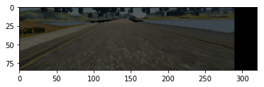

#### Data generator
The Udacity data set combined with data augmentation above provides infinite different training images. Thus I use data generator to feed training data into the optimizer.  
The data generator is designed to generate training data bias to high steering angle. When generating a batch of training data, it first samples a probability threshold `pr_threshold` from 0.4 to 1.0. Then for each images with `abs(angle) < 0.1`, the generator keeps this image with probability `1 - pr_threshold`, which range from 0 to 0.6. By this way the generator makes the label distribution more random in all aspect while making the overall label distribution bias to high steering angle.

#### Optimization
I used `Adam optimizer` with 0.0001 learning rate, and `mse` as loss function. The model was trained using `model.fit_generator()`, with a data generator generating 400 sample for each batch, and 20000 images each epoch. After training 100 epoches, the loss value was reduced to around 0.03. However, as many of others discussed in the forums, `mse` is not a metric of this task. I found that model with loss around 0.04 performs much better than that with 0.03 loss.

---

# Model Analysis
One effective way to analysis the model is to visualize how the learned network response to a given image.

1. 1x1x3 convolution layer  
This layer intends to learn the best color space for this task. However it could also just add noise to make the prediction more difficult. To see its effects, I select a sample image from track 1 and reduced its brightness to 0.05 of the original.  
**The original image:**  
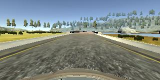  
**The darken image and its RGB planes**  
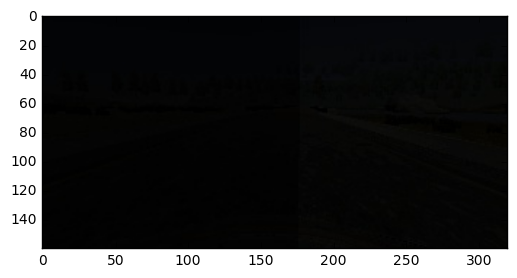
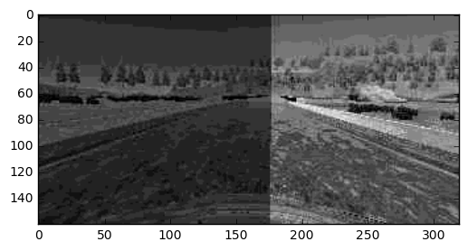
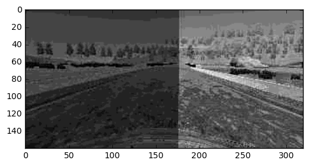
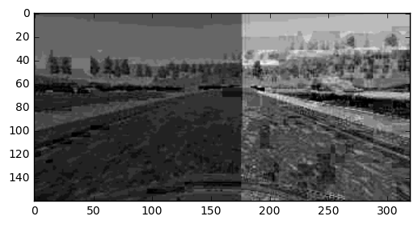  
**Processed by 1x1x3 layer**  
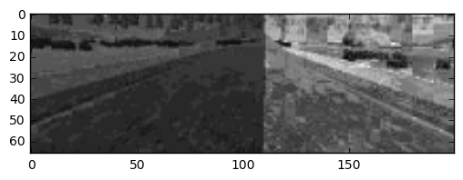
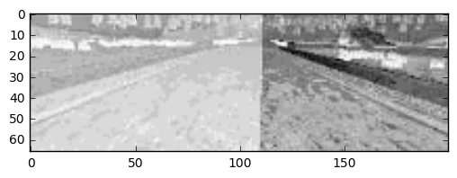
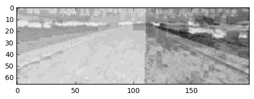  
We can see that this layer can make the shadow area “brighter” than original. However, it's not sure that if this is useful.

2. The next two convolutional layer (5x5x24 and 5x5x36 convolutional layer)  
To see if the convolutional layer learned useful features, I fed a image from track 2 and a image of the real world country road to see what features does the next two layer extract.  
**track 2 image**  
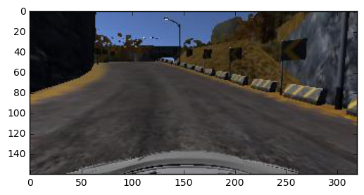  
**first convolutional layer**  
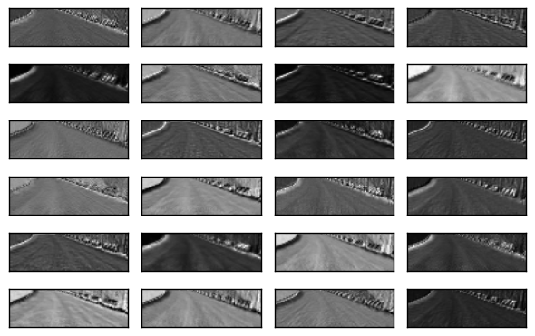  
**second convolutional layer**  
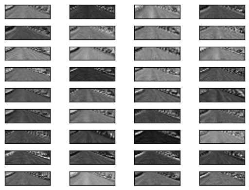  
From the images above we can easily see the road shape of the original image. Let's see how the model "see" an image from real world. The country road image is a unpaved road covered by lots of tree shadows.  
**real world image**  
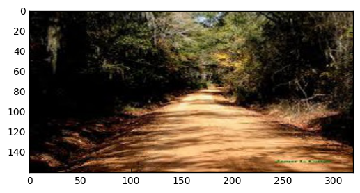  
**first convolutional layer**  
  
**second convolutional layer**  
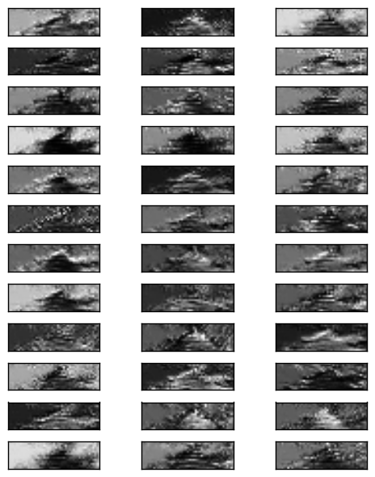  
Although the boundary is blurry (might because of the shadows in the image), we can still see the outline of the road in the output of two layers.
This is a good indicator that the model learned features useful for predicting steer angle, and it can also generalize to unseen roads.
